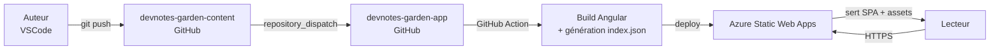
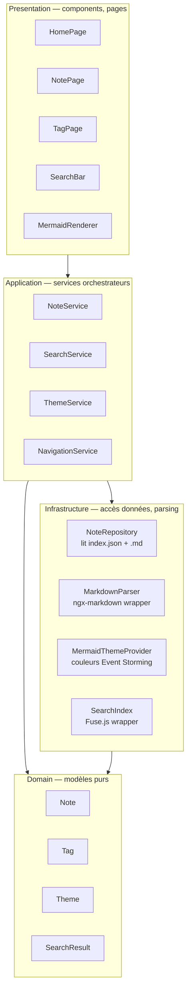
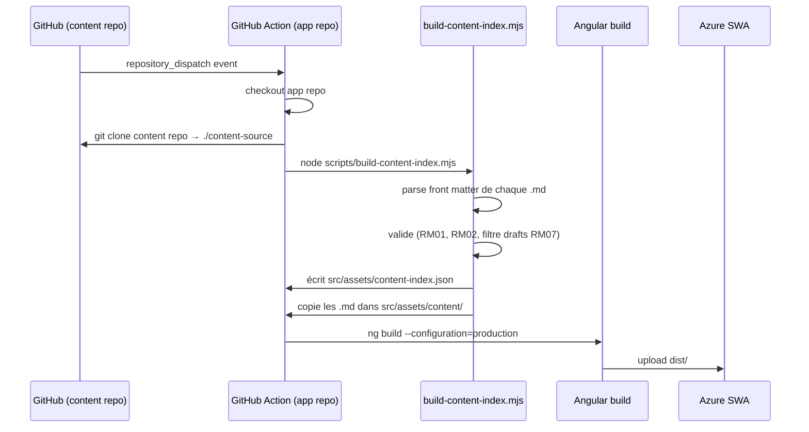
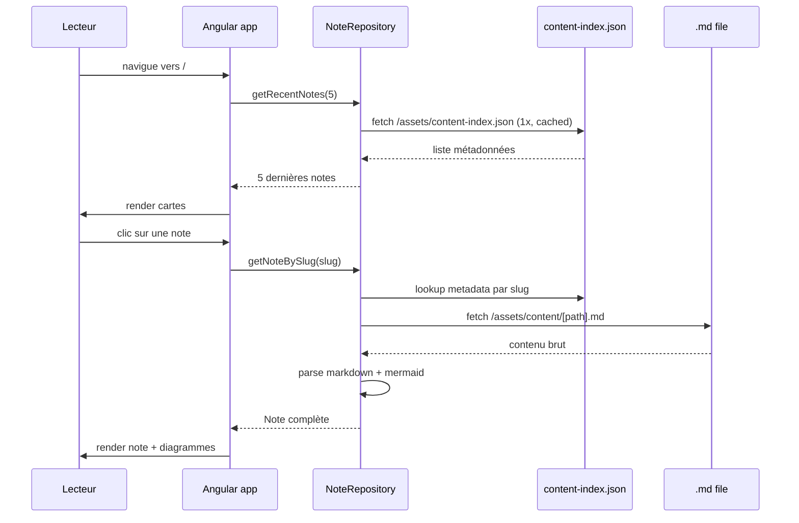
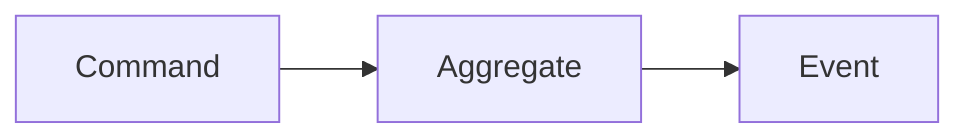

# devnotes-garden — Architecture technique

> Document compagnon de `SPEC.md`. Décrit les choix techniques, la structure du code, les flux de données et les conventions.

## Sommaire

- [1. Vue d'ensemble](#1-vue-densemble)
- [2. Architecture applicative](#2-architecture-applicative)
- [3. Structure des repos](#3-structure-des-repos)
- [4. Flux de données](#4-flux-de-données)
- [5. Format des notes](#5-format-des-notes)
- [6. Rendu des diagrammes Event Storming](#6-rendu-des-diagrammes-event-storming)
- [7. Pipeline CI/CD](#7-pipeline-cicd)
- [8. Conventions de code](#8-conventions-de-code)

---

## 1. Vue d'ensemble



Deux repos, zéro backend applicatif, un seul service managé (Azure Static Web Apps). Le contenu vit dans son propre repo pour découpler la publication de notes du développement de l'app.

---

## 2. Architecture applicative

### 2.1 Clean Architecture allégée

Pas de DDD tactique, mais séparation stricte des responsabilités inspirée de la Clean Architecture.



**Règles de dépendance strictes** :
- `domain` ne dépend de rien (pas même d'Angular)
- `application` dépend de `domain` uniquement
- `infrastructure` dépend de `domain` (implémente des contrats)
- `presentation` dépend de `application` (jamais directement de `infrastructure`)

### 2.2 Structure des dossiers (repo app)

```
src/
├── app/
│   ├── domain/                      # Modèles purs, zéro dépendance Angular
│   │   ├── note.model.ts
│   │   ├── tag.model.ts
│   │   ├── theme.model.ts
│   │   ├── search-result.model.ts
│   │   └── note.model.spec.ts
│   │
│   ├── application/                 # Services métier, orchestration
│   │   ├── note.service.ts
│   │   ├── note.service.spec.ts
│   │   ├── search.service.ts
│   │   ├── search.service.spec.ts
│   │   ├── theme.service.ts
│   │   └── navigation.service.ts
│   │
│   ├── infrastructure/              # Accès données, parsing, adapters
│   │   ├── note-repository.ts
│   │   ├── note-repository.spec.ts
│   │   ├── markdown-parser.ts
│   │   ├── mermaid-theme-provider.ts
│   │   └── search-index.ts
│   │
│   ├── presentation/                # Composants Angular, pages
│   │   ├── pages/
│   │   │   ├── home/
│   │   │   ├── note/
│   │   │   ├── tag/
│   │   │   └── not-found/
│   │   ├── components/
│   │   │   ├── search-bar/
│   │   │   ├── note-card/
│   │   │   ├── sidebar-nav/
│   │   │   ├── theme-toggle/
│   │   │   ├── mermaid-renderer/
│   │   │   └── breadcrumb/
│   │   └── layout/
│   │       └── main-layout/
│   │
│   ├── app.config.ts                # Providers globaux (signals, routing, http)
│   ├── app.routes.ts                # Lazy loading par feature
│   └── app.component.ts
│
├── assets/
│   ├── content-index.json           # Généré au build, listé dans .gitignore
│   └── content/                     # Notes .md copiées au build
│
├── styles/
│   ├── _tokens.scss                 # Variables design (couleurs, typo, spacing)
│   ├── _event-storming.scss         # Palette Event Storming
│   ├── _mermaid-theme.scss          # Thème Mermaid custom
│   ├── themes/
│   │   ├── _light.scss
│   │   └── _dark.scss
│   └── styles.scss
│
└── main.ts
```

### 2.3 Routing (lazy loading)

```typescript
// app.routes.ts
export const routes: Routes = [
  { path: '', loadComponent: () => import('./presentation/pages/home/home.page') },
  { path: 'notes/:slug', loadComponent: () => import('./presentation/pages/note/note.page') },
  { path: 'tags', loadComponent: () => import('./presentation/pages/tag/tags-list.page') },
  { path: 'tags/:tagName', loadComponent: () => import('./presentation/pages/tag/tag.page') },
  { path: '**', loadComponent: () => import('./presentation/pages/not-found/not-found.page') },
];
```

---

## 3. Structure des repos

### 3.1 `devnotes-garden-app`

```
.
├── .github/
│   └── workflows/
│       ├── ci.yml                                                    # build + test + lint sur PR
│       └── azure-static-web-apps-delightful-desert-09d163503.yml    # deploy Azure (push main + repository_dispatch + PR)
├── .husky/
│   ├── pre-commit                   # lint-staged
│   └── commit-msg                   # commitlint
├── docs/
│   ├── SPEC.md
│   ├── ARCHITECTURE.md
│   ├── ROADMAP.md
│   └── CLAUDE.md
├── scripts/
│   └── build-content-index.mjs      # génère content-index.json au build
├── src/                             # code Angular (voir §2.2)
├── .editorconfig
├── .gitignore
├── .prettierrc
├── commitlint.config.mjs
├── eslint.config.mjs                # flat config
├── package.json
├── tsconfig.json
└── README.md
```

### 3.2 `devnotes-garden-content`

```
.
├── .github/
│   └── workflows/
│       └── trigger-app-rebuild.yml  # repository_dispatch vers app repo
├── notes/
│   ├── ddd/
│   │   └── bounded-context-intro.md
│   ├── event-storming/
│   │   └── color-code-guide.md
│   ├── bff/
│   │   └── bff-clean-archi.md
│   └── clean-architecture/
│       └── layers-explained.md
├── assets/
│   └── images/
│       └── event-storming-example.png
└── README.md
```

---

## 4. Flux de données

### 4.1 Build-time (côté CI)



### 4.2 Runtime (côté navigateur)



---

## 5. Format des notes

### 5.1 Front matter (obligatoire — RM01)

```yaml
---
title: "Introduction au Bounded Context"
slug: bounded-context-intro
tags: [ddd, architecture, strategic-design]
created: 2026-04-10
updated: 2026-04-16
summary: "Comment découper un système complexe en contextes métier cohérents."
draft: false
---
```

**Champs** :
| Champ | Type | Obligatoire | Description |
|-------|------|-------------|-------------|
| `title` | string | oui | Titre affiché de la note |
| `slug` | string (kebab-case) | oui | Identifiant unique, utilisé dans l'URL |
| `tags` | string[] | oui (peut être `[]`) | Liste des tags associés |
| `created` | ISO date | oui | Date de création, immuable |
| `updated` | ISO date | oui | Date de dernière modification |
| `summary` | string | oui | Résumé court (1-2 phrases), affiché dans les cartes |
| `draft` | boolean | non (défaut `false`) | Si `true`, la note est exclue du build (RM07) |

### 5.2 Corps de la note

Markdown standard avec deux extensions :

**Blocs de code classiques** (coloration via Prism) :
````markdown
```csharp
public record BookingConfirmed(Guid BookingId, DateTime ConfirmedAt);
```
````

**Blocs Mermaid classiques** :
````markdown

````

**Blocs `event-storming` custom** (applique automatiquement le code couleur) :
````markdown
```event-storming
actor User
command "Book a flight"
aggregate Booking
event "BookingConfirmed"
policy "Send confirmation email"
readModel "My bookings"
```
````

Le bloc `event-storming` est parsé côté app et transformé en diagramme Mermaid avec les classes CSS appliquées (voir §6).

---

## 6. Rendu des diagrammes Event Storming

### 6.1 Palette normalisée (RM04)

```scss
// _event-storming.scss
$es-domain-event:     #FF9800;  // orange
$es-command:          #03A9F4;  // bleu ciel
$es-actor:            #FFEB3B;  // jaune
$es-policy:           #9C27B0;  // violet
$es-read-model:       #8BC34A;  // vert clair
$es-aggregate:        #FBC02D;  // jaune foncé
$es-external-system:  #E91E63;  // rose
$es-hotspot:          #F44336;  // rouge
```

### 6.2 Stratégie de rendu

Le `MermaidRenderer` (composant Angular) :

1. Reçoit un bloc de code en entrée (langage `mermaid` ou `event-storming`)
2. Si `event-storming` : transforme la syntaxe DSL custom en Mermaid avec `classDef` appliqués
3. Initialise Mermaid avec le thème `base` et les couleurs custom injectées via `themeVariables`
4. Génère le SVG
5. Insère dans le DOM avec support du zoom/pan via `panzoom` (lib légère)

### 6.3 Exemple de transformation DSL → Mermaid

**Entrée** (dans le `.md`) :
````
```event-storming
actor User
command "Book flight"
event "BookingConfirmed"
```
````

**Mermaid généré** :
```
graph LR
  A[User]:::actor --> B[Book flight]:::command
  B --> C[BookingConfirmed]:::domainEvent
  classDef actor fill:#FFEB3B,stroke:#F9A825,color:#000
  classDef command fill:#03A9F4,stroke:#01579B,color:#fff
  classDef domainEvent fill:#FF9800,stroke:#E65100,color:#000
```

---

## 7. Pipeline CI/CD

### 7.1 Workflow CI (`ci.yml`)

Déclencheurs : PR sur `main`, push sur branches de feature.

Étapes : install deps → lint → test Vitest (coverage > 80%) → build vérif.

### 7.2 Workflow Azure SWA (`azure-static-web-apps-delightful-desert-09d163503.yml`)

Un seul fichier gère trois déclencheurs :
- `push` sur `main` du repo app
- `repository_dispatch` de type `content-updated` (envoyé par le repo content)
- `pull_request` sur `main` (preview + cleanup)

La commande de build custom inclut le clonage du repo content avant `ng build` :

```yaml
app_build_command: >
  git clone https://github.com/lolofx/devnotes-garden-content.git content-source &&
  node scripts/build-content-index.mjs &&
  npm run build
```

Ce fichier est généré initialement par Azure SWA et modifié manuellement. Ne pas le renommer — Azure l'identifie par son nom pour gérer les previews de PR.

### 7.3 Workflow Content Sync (`trigger-app-rebuild.yml` côté content)

Fichier situé dans `devnotes-garden-content/.github/workflows/trigger-app-rebuild.yml`.

Déclencheur : push sur `main` du repo content.

Envoie un `repository_dispatch` vers le repo app via l'API GitHub :

```yaml
name: Trigger app rebuild

on:
  push:
    branches: [main]

jobs:
  dispatch:
    runs-on: ubuntu-latest
    steps:
      - name: Send repository_dispatch to app repo
        uses: peter-evans/repository-dispatch@v3
        with:
          token: ${{ secrets.APP_REPO_PAT }}
          repository: lolofx/devnotes-garden-app
          event-type: content-updated
```

**Prérequis** :
- Créer un PAT GitHub (classic) avec le scope `repo` sur le compte `lolofx`
- L'ajouter comme secret nommé `APP_REPO_PAT` dans le repo `devnotes-garden-content`
- L'action `peter-evans/repository-dispatch@v3` envoie l'event ; le repo app l'écoute via `repository_dispatch: types: [content-updated]`

---

## 8. Conventions de code

### 8.1 Angular 21 — patterns senior

- **Standalone partout** : pas de `NgModule`
- **Zoneless** : configuré via `provideZonelessChangeDetection()` dans `app.config.ts`
- **Signals first** : pas de `BehaviorSubject` pour l'état local/partagé, signals uniquement
- **`inject()`** partout, jamais de constructor injection
- **Control flow natif** : `@if`, `@for`, `@switch`, plus de `*ngIf`/`*ngFor`
- **`input()` et `output()`** signal-based, pas les décorateurs `@Input`/`@Output`
- **`computed()` et `effect()`** pour la dérivation et les effets de bord
- **Lazy loading** sur toutes les routes
- **OnPush implicite** en zoneless

### 8.2 TypeScript

- `strict: true` + `noImplicitAny`, `strictNullChecks`, `noUncheckedIndexedAccess`
- Pas de `any`, pas de `as` abusif
- Types explicites sur les signatures publiques
- `readonly` par défaut sur les propriétés qui ne changent pas

### 8.3 Tests (Vitest + TDD strict)

- **Red / Green / Refactor** systématique, un test à la fois
- Nommage : `should [comportement attendu] when [condition]`
- Un fichier `.spec.ts` à côté de chaque fichier testé
- `describe` par classe/service, `it` par comportement
- Mocks via `vi.fn()` et `vi.spyOn()`
- Couverture cible : **> 80%** sur `domain` et `application`

### 8.4 Nommage

- **Fichiers** : `kebab-case.ts` (`note-repository.ts`)
- **Classes** : `PascalCase` (`NoteRepository`)
- **Signals** : `camelCase` sans préfixe (`notes`, pas `notes$`)
- **Services** : suffixés `Service` (`NoteService`)
- **Pages** : suffixées `Page` (`HomePage`, fichier `home.page.ts`)
- **Composants** : suffixés `Component` dans le nom de classe, pas dans le fichier (`search-bar.component.ts` → `SearchBarComponent`)

### 8.5 Git

- **Branches** : `feat/`, `fix/`, `chore/`, `docs/`, `test/`, `refactor/`
- **Commits** : Conventional Commits (`feat(search): add full-text index`)
- **PRs** : squash merge, titre = message de commit final
